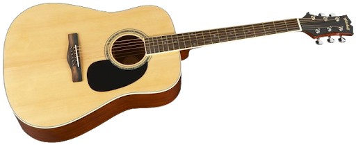

# Hi, I'm Thomas!! 👋

## My name is Thomas Garry. I’m an aspiring software engineer who loves learning!

Aside from programming I’ve been learning guitar through videos like this [Slow Dancing in the Dark - Joji, Fingerstyle Guitar](https://www.youtube.com/watch?v=NJm8BdpH1C0). I didn't have much official training and so I have mainly been learning songs rather than learning scales. I love the sound of acoustic guitar and fingerpicking as it is extremely soothing to me. For most of the songs I learn, I only learn some of the parts that I like.
**Some of my _favorite_ songs to play are**
- I'd love to change the world, Ten Years After
- You've Got a Friend in Me (fingerstyle), Randy Newman
- Blackbird, The Beatles
- Dream a Little Dream (fingerstyle), Doris Day
- Simple Things You Do, Michael Carreon
- Corduroy Dreams, Rex Orange County
- Married Life (from my favorite Pixar movie, Up), Michael Giacchino  
- The Night We Met, Lord Huron
- Where is My Mind, Pixies

Clearly, I like different music and am now taking basic music theory classes as well!
> I will learn more songs `soon`

I also am very active in the [**ACM**](https://acmucsd.com/) and [**TSE**](https://tse.ucsd.edu/)! So I do like to code and in fact my favorite line of code in every language is similar to: 

```print("Hello World!")```

[link to README](./README.md)

**Bucket List Items:**
- [ ] Own a cat
- [ ] Make a million dollars
- [x] Play Guitar

I also love cats and trying to stay active!



